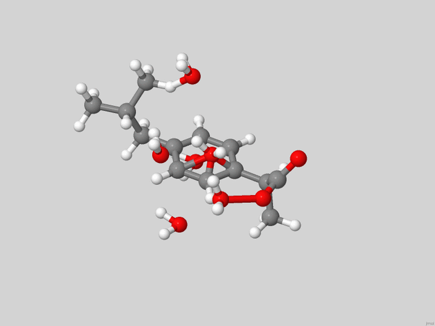
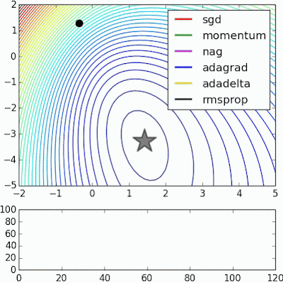
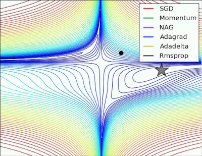
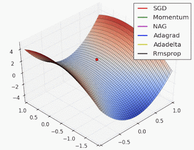
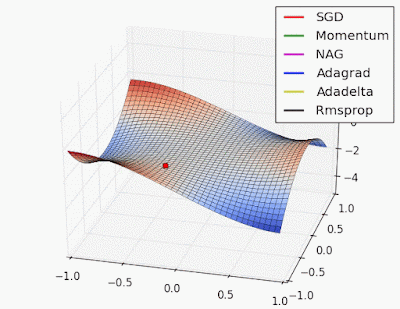

<!-- [](https://www.python.org/downloads/release/python-390/)

[](https://gitlab.com/ADanianZE/ascec/-/commits/main)

[](https://coveralls.io/gitlab/ADanianZE/ascec?branch=main)
[](https://gitlab.com/ADanianZE/ascec/-/commits/main)
[](https://mybinder.org/v2/gl/ADanianZE%2Fascec/main?filepath=workflow%2F01_importing_atoms_and_molecules.ipynb)

[](http://mypy-lang.org/)
[](https://github.com/psf/black)
  -->

<!--  -->


<div align="center">
  <a href=http://mypy-lang.org/>
  </a>
  <a href=https://github.com/psf/black>
  </a>
  <br>
  <a href=https://www.python.org/downloads/release/python-390/>
  </a>
  <a href=https://www.gnu.org/licenses/gpl-3.0>
  </a>
  <a href=https://mybinder.org/v2/gl/ADanianZE%2Fascec/main?filepath=workflow%2F01_importing_atoms_and_molecules.ipynb>
  </a>
  <br>  
  <a href=https://img.shields.io/gitlab/pipeline/ADanianZE/ascec/main?style=plastic>
  </a>
  <a href=https://gitlab.com/ADanianZE/ascec/-/commits/main>
  </a>
  <a href=https://img.shields.io/gitlab/coverage/ADanianZE/ascec/main?style=plastic>
  </a>
  <a href=https://coveralls.io/gitlab/ADanianZE/ascec?branch=main>
  </a>
</div>

---

<div align="center">
  <a href="Atomic and Molecular Cluster Energy Surface Sampler">
  </a>
  <br>
</div>

---

<div align="center">
  <h1> Atomic and Molecular Cluster Energy Surface Sampler (AMCESS) </h1>
</div>

Tools to explore the Potential Energy Surface (PES) for atomic and molecular 
systems and generate candidate structures for the local and global minima.


<div align="center">
  
  
  <br>
  Molecular cluster of ibuprofen and six water molecules
  [<a href="http://www.doi.org/10.1063/1.4874258">doi: 10.1063/1.4874258</a>]
  <br>
  <br>
</div>

<div align="center">
  
  
  <br>
  
  
  <br> 
  Example images taken from Deniz Yuret's blog on October 29, 2021 
  <br>
  from:
  <a href="http://www.denizyuret.com/2015/03/alec-radfords-animations-for.html">Alec Radford's animations for optimization algorithms</a>
</div>

### Description
Some of the technics implemented are:

 * Stochastic
      * Simulated Annealing (Metropolis-Monte Carlo)
      * Dual Annealing
* Bayesian Optimization

To compute the energy (cost-function), one could use some of these 
quantum chemistry packages:

- Non Relativistic: NWChem, Gaussian, DALTON,
GAMESS

- Relativistic: DIRAC, ADF

### Technical Documentation
Technical documents behind this project can be accessed [here](https://adanianze.gitlab.io/ascec).


### Requirements

First you should install the required python packages contained in the file `requirements.txt`. For developer, you should install `requirements_dev.txt`.

### Installation
AMCESS is writyten for **Python 3.9**

1. Install virtual environment:

    ```python -m venv venv```

2. Activate virtual environment:

    ```source venv/bin/activate```

3. Install dependencies:

    ```pip install -r requirements.txt```

      3.1. For developer:
             ```pip install -r requirements_dev.txt```

      3.2 Run all test:
            ``tox``


4. Run AMCESS:
    
    ```
    >>>pip install -e .
    Installing collected packages: amcess
    Running setup.py develop for amcess
    Successfully installed amcess
    >>>from amcess.base_molecule import Molecule, Cluster
    ...
    ```

### Usage

A detail workflow is provide into `workflow` directory. It has a list of Jupyter notebook with detail examples about AMCESS tools and capabilities.

Workflow:
1. Getting starting with atoms and molecules properties. 
      - Notebook ([binder](https://mybinder.org/v2/gl/ADanianZE%2Fascec/main?filepath=workflow%2F01_importing_atoms_and_molecules.ipynb)): `01_importing_atoms_and_molecules.ipynb` 
2. Translating and rotating atoms and molecules. 
      - Notebook ([binder](https://mybinder.org/v2/gl/ADanianZE%2Fascec/main?filepath=workflow%2F02_move_rotate_molecules.ipynb)): `02_move_rotate_molecules.ipynb` 
3. Moving Molecules randomly from a Cluster. 
      - Notebook ([binder](https://mybinder.org/v2/gl/ADanianZE%2Fascec/main?filepath=workflow%2F03_move_rotate_cluster.ipynb)): `03_move_rotate_cluster.ipynb` 
4. Freezing any molecule and redefine its sphere center. 
      - Notebook ([binder](https://mybinder.org/v2/gl/ADanianZE%2Fascec/main?filepath=workflow%2F04_freeze_molecule_redefine_center.ipynb)): `04_freeze_molecule_redefine_center.ipynb` 
5. Initialize a cluster avoiding atomic overlapping
      - Notebook ([binder](https://mybinder.org/v2/gl/ADanianZE%2Fascec/main?filepath=workflow%2F05_initialize_cluster_and_move_molecule.ipynb)): `05_initialize_cluster_and_move_molecule.ipynb` 

## Support
Tell people where they can go to for help. It can be any combination of an issue tracker, a chat room, an email address, etc.

## Roadmap


## Contributing
State if you are open to contributions and what your requirements are for accepting them.

For people who want to make changes to your project, it's helpful to have some documentation on how to get started. Perhaps there is a script that they should run or some environment variables that they need to set. Make these steps explicit. These instructions could also be useful to your future self.

You can also document commands to lint the code or run tests. These steps help to ensure high code quality and reduce the likelihood that the changes inadvertently break something. Having instructions for running tests is especially helpful if it requires external setup, such as starting a Selenium server for testing in a browser.

### Licence
GNU General Public License v3 (GLPv3)

### Authors and Acknowledgment
Main authors: Alejandra Mendez, Juan Jose Aucar, Daniel Bajac, César Ibargüen, Andy Zapata, Edison Florez (_edisonffh@mail.com_)

### Project Status

Under development


---

## ascec (OLD version in FORTRAN77)

El ascec es un programa de annealing simulado con modificación de criterío de Metropolis,
por Energía Cuántica o Energía Electrónica, la cual se puede calcular, usando una metodología
No--Relativista (DALTON, Gaussian, NWChem, GAMMES, ...), Cuasi--Relativista (ADF, ...) 
o Realtivista (DIRAC, ...)

El proposito de esta herramienta computacional es el encontrar estructuras candidatas de algun
agregado molecular, por medio de una exploración estocástica de su superficie de energía potencial

En la carpeta ASCECV3, se encuentra el fuente del programa ascec escrito en fortran77. 

ASCECV3

   |----papers  (articulos en que se uso)

   |----p_ascec (En esta se encuentra los diferentes archivos fuentes)

   |----examples
         |---adf     (ejemplo usando el adf)

         |---dalton  (ejemplo usando el dalton)

         |---g03

         |---gamess
         
         |---nwchem

Para compilar los archivos fuentes, basta con ejecutar el script c_ascec.sh dentro de p_ascec, esto
crea un ejecutable que se mueve afuera de este carpeta con el nombre de ascec-v03

Para ejecutarla ascec-v03, se podría usar alguno de los archivos de extensión .in dentro de las carpetas
dentro de examples. Tener en cuenta que para poder usar el ASCEC, se debe tener instalado y articulado el
programa con el que se va calcular la energía cuátnica, lo cual se hace por medio del archivo fuente 
function_E.f

## Getting started

To make it easy for you to get started with GitLab, here's a list of recommended next steps.

Already a pro? Just edit this README.md and make it your own. Want to make it easy? [Use the template at the bottom](#editing-this-readme)!

## Add your files

- [ ] [Create](https://gitlab.com/-/experiment/new_project_readme_content:775b3b378a4e42628dd08a5d18ca586f?https://docs.gitlab.com/ee/user/project/repository/web_editor.html#create-a-file) or [upload](https://gitlab.com/-/experiment/new_project_readme_content:775b3b378a4e42628dd08a5d18ca586f?https://docs.gitlab.com/ee/user/project/repository/web_editor.html#upload-a-file) files
- [ ] [Add files using the command line](https://gitlab.com/-/experiment/new_project_readme_content:775b3b378a4e42628dd08a5d18ca586f?https://docs.gitlab.com/ee/gitlab-basics/add-file.html#add-a-file-using-the-command-line) or push an existing Git repository with the following command:

```
cd existing_repo
git remote add origin https://gitlab.com/ADanianZE/ascec.git
git branch -M main
git push -uf origin main
```

## Integrate with your tools

- [ ] [Set up project integrations](https://gitlab.com/-/experiment/new_project_readme_content:775b3b378a4e42628dd08a5d18ca586f?https://docs.gitlab.com/ee/user/project/integrations/)

## Collaborate with your team

- [ ] [Invite team members and collaborators](https://gitlab.com/-/experiment/new_project_readme_content:775b3b378a4e42628dd08a5d18ca586f?https://docs.gitlab.com/ee/user/project/members/)
- [ ] [Create a new merge request](https://gitlab.com/-/experiment/new_project_readme_content:775b3b378a4e42628dd08a5d18ca586f?https://docs.gitlab.com/ee/user/project/merge_requests/creating_merge_requests.html)
- [ ] [Automatically close issues from merge requests](https://gitlab.com/-/experiment/new_project_readme_content:775b3b378a4e42628dd08a5d18ca586f?https://docs.gitlab.com/ee/user/project/issues/managing_issues.html#closing-issues-automatically)
- [ ] [Automatically merge when pipeline succeeds](https://gitlab.com/-/experiment/new_project_readme_content:775b3b378a4e42628dd08a5d18ca586f?https://docs.gitlab.com/ee/user/project/merge_requests/merge_when_pipeline_succeeds.html)

## Test and Deploy

Use the built-in continuous integration in GitLab.

- [ ] [Get started with GitLab CI/CD](https://gitlab.com/-/experiment/new_project_readme_content:775b3b378a4e42628dd08a5d18ca586f?https://docs.gitlab.com/ee/ci/quick_start/index.html)
- [ ] [Analyze your code for known vulnerabilities with Static Application Security Testing(SAST)](https://gitlab.com/-/experiment/new_project_readme_content:775b3b378a4e42628dd08a5d18ca586f?https://docs.gitlab.com/ee/user/application_security/sast/)
- [ ] [Deploy to Kubernetes, Amazon EC2, or Amazon ECS using Auto Deploy](https://gitlab.com/-/experiment/new_project_readme_content:775b3b378a4e42628dd08a5d18ca586f?https://docs.gitlab.com/ee/topics/autodevops/requirements.html)
- [ ] [Use pull-based deployments for improved Kubernetes management](https://gitlab.com/-/experiment/new_project_readme_content:775b3b378a4e42628dd08a5d18ca586f?https://docs.gitlab.com/ee/user/clusters/agent/)

***

# Editing this README

When you're ready to make this README your own, just edit this file and use the handy template below (or feel free to structure it however you want - this is just a starting point!).  Thank you to [makeareadme.com](https://gitlab.com/-/experiment/new_project_readme_content:775b3b378a4e42628dd08a5d18ca586f?https://www.makeareadme.com/) for this template.

## Suggestions for a good README
Every project is different, so consider which of these sections apply to yours. The sections used in the template are suggestions for most open source projects. Also keep in mind that while a README can be too long and detailed, too long is better than too short. If you think your README is too long, consider utilizing another form of documentation rather than cutting out information.

## Name
Choose a self-explaining name for your project.

## Description
Let people know what your project can do specifically. Provide context and add a link to any reference visitors might be unfamiliar with. A list of Features or a Background subsection can also be added here. If there are alternatives to your project, this is a good place to list differentiating factors.

## Badges
On some READMEs, you may see small images that convey metadata, such as whether or not all the tests are passing for the project. You can use Shields to add some to your README. Many services also have instructions for adding a badge.

## Visuals
Depending on what you are making, it can be a good idea to include screenshots or even a video (you'll frequently see GIFs rather than actual videos). Tools like ttygif can help, but check out Asciinema for a more sophisticated method.

## Installation
Within a particular ecosystem, there may be a common way of installing things, such as using Yarn, NuGet, or Homebrew. However, consider the possibility that whoever is reading your README is a novice and would like more guidance. Listing specific steps helps remove ambiguity and gets people to using your project as quickly as possible. If it only runs in a specific context like a particular programming language version or operating system or has dependencies that have to be installed manually, also add a Requirements subsection.

## Usage
Use examples liberally, and show the expected output if you can. It's helpful to have inline the smallest example of usage that you can demonstrate, while providing links to more sophisticated examples if they are too long to reasonably include in the README.


Show your appreciation to those who have contributed to the project.

## License
For open source projects, say how it is licensed.

## Project status
If you have run out of energy or time for your project, put a note at the top of the README saying that development has slowed down or stopped completely. Someone may choose to fork your project or volunteer to step in as a maintainer or owner, allowing your project to keep going. You can also make an explicit request for maintainers.

