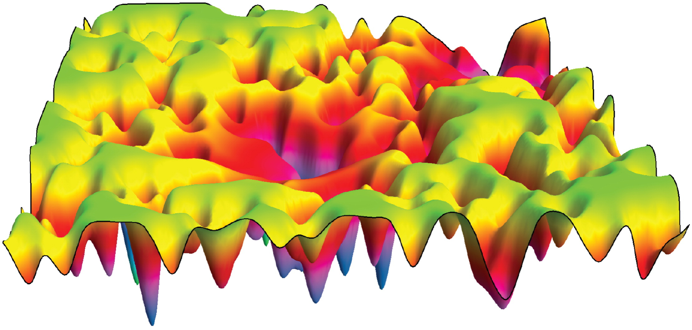

Candidate Structures
=====================

Finding critical points on potential energy surfaces (PES) is a challenging problem in computational chemistry, especially as the number of atoms increases. In the following sections, we will introduce various tools implemented in AMCESS that can effectively address this complexity.

.. _fig_cs1:

   Fig. 1 : A schematic representation of a three--dimensional Potential Energy Surface (PES). Taken from reference :cite:`pes_review_image`.

.. toctree::
    :maxdepth: 4

    candidatestructures/ascec
    candidatestructures/dualannealing

