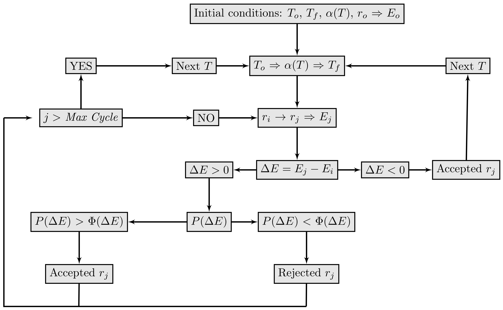

ASCEC
-----

The Simulated Annealing (SA) algorithm was inspired by the annealing process that takes place in metallurgy, whereby annealing a molten metal causes it to achieve its global minimum in terms of thermodynamic energy. The following scheme shows a general view of a single Monte Carlo cycle.

1. Select a molecule/atom at random (configuration a)
2. Calculate the total energy (:math:`E_a`)
3. Give the molecule/atom a random move (configuration b)
4. Calculate the new total energy (:math:`E_b`)
5. Accept the move from a to b with probability (Metropolis criterion)

.. math:: P(a\rightarrow b) = e^{-\beta \Delta E}

where :math:`\Delta E = E_b - E_a`, :math:`\beta = 1/k_BT`, and :math:`k_B` is the Boltzmann constant. If the new configuration is rejected, the old configuration (a) is kept. The next temperature :math:`T` is selected from a geometric grid only when the energy for the new configuration is lower than the old one (:math:`E_b < E_a`).

Regarding to Metropolis criterion, the acceptance probability is compare with a uniform distribution of random numbers, the ASCEC criterion uses a relative change in energy (:math:`(E_b - E_a)/E_b`) to avoid rejecting "good" structures, randomly. Restrepo and coworkers :cite:`li+,w4` have found the latter acceptance criterion to be more adequate for PES in atomic and molecular cluster than the usual procedure of comparing again to a randomly generated number. The Figure 2 shows a flow diagram for the Simulated Annealing procedure with a modified Metropolis acceptance criterion. On the Markov chain, new configurations with a lower energy are always accepted (:math:`\Delta E = E_b - E_a < 0`). However, when :math:`\Delta E > 0` this new configuration is accepted when the probability of this change :math:`P(\Delta E) = e^{-\Delta E/k_BT}` is larger than the relative change in energy :math:`\phi(\Delta E) = |(E_b - E_a)/E_b|`.

.. _fig_ascec:

   Fig. 2 :  The ascec flow diagram. Where To is the initial temperature, Tf is the final temperature, :math:`alpha(T)` is the quenching route and the function :math:`\phi(\Delta E) = |(E_b - E_a)/E_b|` is the new criterion for the acceptance of new configuration.