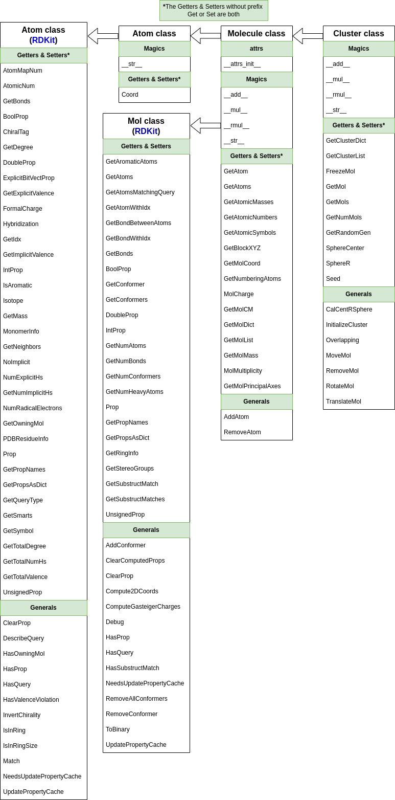

Input
=====

In this chapter is described the AMCESS's input classes:

* Atom class
* Molecule class
* Cluster class

Molecule objects are list of Atom objects while the cluster objects
are list of Molecule object or in another words, they are list of
list of Atom objects (see :numref:`alg_i1`).

.. _alg_i1:

.. code-block:: python
   :caption: : Python pseudo--code about the Molecule and Cluster objects.

    mol = Molecule([('O', 0., 0., 0.),
                    ('H', 0., -1., 1.),
                    ('H', 0., 1., 1.)])
    print(mol.GetAtoms())
    [<amcess.atom.Atom object at 0x7f8df829dd50>,
    <amcess.atom.Atom object at 0x7f8df829c090>,
    <amcess.atom.Atom object at 0x7f8df829c180>]

    cluster = Cluster(
    [[('O', 0., 0., 0.), ('H', 0., -1., 1.), ('H', 0., 1., 1.)],
    [('O', 0., 0., 0.), ('H', 0., -1., 1.), ('H', 0., 1., 1.)]]
    )
    print(cluster.GetMols())
    [<amcess.molecule.Molecule object at 0x3f8qp477rr45>,
    <amcess.molecule.Molecule object at 0x3f8qp3w1z187>]

The Atom, Molecule, and Cluster classes were designed like is show in the next 
UML graphic: 

.. _my-figure:

   : Representation of the inheritance of the Atom, Molecule, and Cluster classes, through a UML graph, in the AMCESS package.

.. toctree::

    input/atom
    input/molecule
    input/cluster